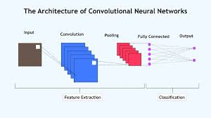

# Convolutional Neural Networks (CNN) and Their Application in Cybersecurity

A Convolutional Neural Network (CNN) is a specific architecture of Deep Learning designed to process multi-dimensional structured data—for example, images, time series, and signals. Unlike traditional fully connected networks, CNNs use mathematical convolution operations. This allows the model to recognize local features and maintain the spatial hierarchy in the data without losing important details.

The CNN architecture mainly consists of three fundamental types of layers:
1. **Convolutional Layer**: This is the core of the network. Here, filters (kernels) are applied over the input data, resulting in the creation of a feature map.
2. **Pooling Layer**: Its purpose is dimensionality reduction, which reduces computational complexity and protects the model from overfitting. The most popular form is Max Pooling.
3. **Fully Connected Layer**: The final stage of the network, which combines the high-level features obtained from the previous layers and performs the final classification.



### CNN in Cybersecurity
Although CNNs were originally created for Computer Vision, they have shown tremendous potential in the field of cybersecurity. Given the increasing complexity of cyberattacks, traditional rule-based antiviruses and detection systems often fail to cope with "Zero-Day" threats. 

CNNs are successfully used for Malware classification. In this process, binary files (e.g., .exe) are converted into 8-bit 2D images, and a CNN is used to detect visual anomalies characteristic of malicious code within these "images". Furthermore, 1D CNNs are ideal for Network Traffic Analysis and packet inspection. The model learns what normal traffic behavior looks like; consequently, any pattern indicating a DDoS attack, port scanning, or data exfiltration is automatically classified as an intrusion. The main advantage of this method is that feature extraction happens automatically through convolutional filters, without any manual preprocessing.

---

### Practical Example: 1D CNN for Detecting Network Traffic Anomalies (DDoS)

Below is the Python code using `TensorFlow/Keras`. The code includes the generation of synthetic network traffic data, ensuring that the code can be run independently (without additional files) as the data and source code must be included in the file.

```python
import numpy as np
import tensorflow as tf
from tensorflow.keras import layers, models
import matplotlib.pyplot as plt

# 1. Data Generation (Simulation)
# Simulating 2000 network traffic records with 50 features each
num_samples = 2000
num_features = 50

# Synthetic data: Normal (0) and Malicious/DDoS traffic (1)
X = np.random.rand(num_samples, num_features)
y = np.random.randint(0, 2, num_samples)

# CNN requires data in the format: (samples, timesteps, features)
X = X.reshape(X.shape[0], X.shape[1], 1)

# Splitting data into training (80%) and testing (20%) sets
split = int(0.8 * num_samples)
X_train, X_test = X[:split], X[split:]
y_train, y_test = y[:split], y[split:]

# 2. Creating the 1D CNN Model Architecture
model = models.Sequential([
    # Explicit Input layer to avoid Keras warnings
    layers.Input(shape=(num_features, 1)),
    
    # First Convolutional Layer
    layers.Conv1D(filters=32, kernel_size=3, activation='relu'),
    layers.MaxPooling1D(pool_size=2),
    
    # Second Convolutional Layer
    layers.Conv1D(filters=64, kernel_size=3, activation='relu'),
    layers.MaxPooling1D(pool_size=2),
    
    # Flattening and Classification
    layers.Flatten(),
    layers.Dense(64, activation='relu'),
    layers.Dense(1, activation='sigmoid') # Binary (0 or 1) output
])

# 3. Model Compilation
model.compile(optimizer='adam',
              loss='binary_crossentropy',
              metrics=['accuracy'])

# 4. Training the Model
history = model.fit(X_train, y_train, epochs=15, batch_size=32, 
                    validation_data=(X_test, y_test), verbose=0)

# 5. Model Evaluation
test_loss, test_acc = model.evaluate(X_test, y_test, verbose=0)
print(f"Model Test Accuracy for detecting network anomalies: {test_acc:.4f}")

# 6. Visualizing the training process
plt.plot(history.history['accuracy'], label='Training Accuracy')
plt.plot(history.history['val_accuracy'], label='Validation Accuracy')
plt.title('CNN Model Training Curve')
plt.xlabel('Epoch')
plt.ylabel('Accuracy')
plt.legend()
```
# Saving the plot to the current directory
plt.savefig('cnn_training_plot.png')
