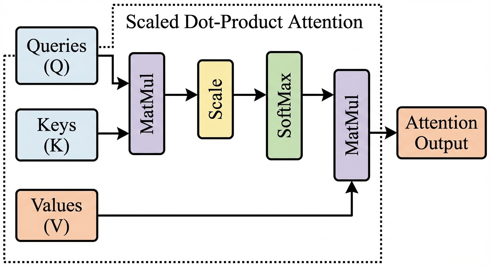
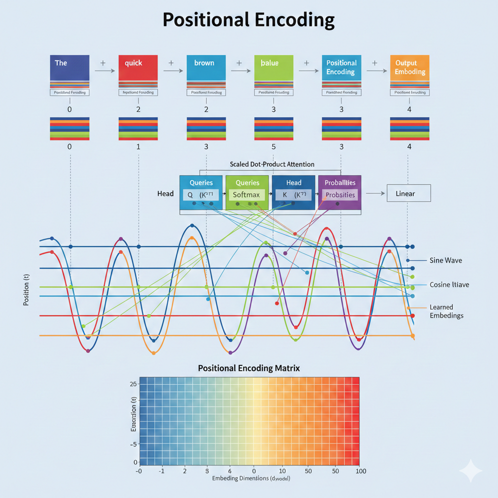

# Transformer Networks and Their Applications in Cybersecurity

The Transformer architecture, introduced by Vaswani et al. in 2017, represents a monumental shift in deep learning, particularly for natural language processing (NLP) and sequential data tasks. Unlike traditional Recurrent Neural Networks (RNNs) or LSTMs that process data sequentially, Transformers process entire sequences simultaneously. This parallelization drastically reduces training time and allows the model to capture long-range dependencies within the data much more effectively.

### Core Mechanisms of the Transformer

The fundamental innovation of the Transformer is the **Self-Attention Mechanism**. Instead of relying on hidden states to carry context over time, self-attention allows the model to weigh the importance of different elements in an input sequence relative to a specific target token. By computing Queries, Keys, and Values, the attention layer determines which parts of the input are most relevant to each other, creating a rich and dynamic contextual representation.

Because the Transformer processes tokens in parallel without an inherent sense of sequential order, it requires **Positional Encoding**. Positional encodings are fixed or learned vectors added to the input embeddings that provide the model with information about the relative or absolute position of the tokens in the sequence. These encodings often use sine and cosine functions of different frequencies, allowing the model to easily learn to attend to relative positions.

### Applications in Cybersecurity

Transformers have found highly effective applications in the field of cybersecurity, primarily due to their ability to process massive streams of sequential data and understand complex contextual patterns:

1. **Log Analysis and Threat Hunting:** Security Information and Event Management (SIEM) systems generate enormous amounts of log data. Transformers can be trained on these logs to establish a baseline of normal system behavior. The self-attention mechanism excels at identifying subtle, distributed anomalies across large log sequences that might indicate an Advanced Persistent Threat (APT) or a coordinated cyberattack.
2. **Malware Detection via API Sequences:** Instead of relying solely on static binary analysis, dynamic analysis logs the sequence of API calls made by an executable. Transformers can analyze these sequences just like a sentence in natural language, understanding the "intent" behind a series of actions and accurately classifying malicious software.
3. **Phishing Detection:** Through advanced NLP capabilities, Transformer-based models (like BERT or RoBERTa) can deeply analyze the semantic context of emails, distinguishing between legitimate corporate communications and sophisticated phishing attempts that traditional spam filters might easily miss.

