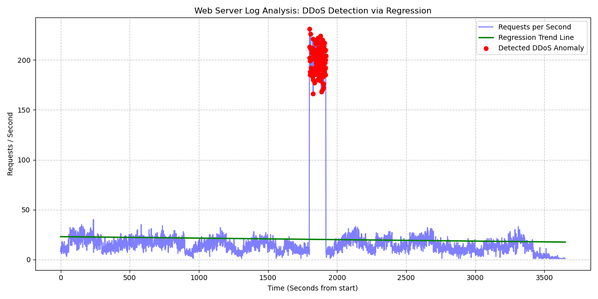

# Web Server Log Analysis: DDoS Attack Detection

## 1. Objective and Data Source
The primary objective of this task is to analyze a given web server log file to identify the exact time interval of a Distributed Denial of Service (DDoS) attack. The analysis relies on statistical methods, specifically Linear Regression, to detect anomalous spikes in network traffic.

* **Log File:** [a_migineishvili25_93254_server.log](a_migineishvili25_93254_server.log)
* **Source Code:** [task_3.py](task_3.py)

## 2. Methodology
To reproduce the findings, the following analytical steps were performed using Python (`numpy` and `matplotlib`):
1. **Data Parsing:** The timestamp of each incoming request was extracted from the log file using regular expressions and converted into UNIX timestamps. The data was aggregated to count the number of requests per second.
2. **Regression Analysis:** A Linear Regression model (polynomial degree 1) was fitted to the data to establish a baseline trend line for normal server traffic.
3. **Anomaly Detection:** Residuals (the difference between actual requests and the predicted trend) were calculated. Using the **3-Sigma Rule** (Mean + 3 * Standard Deviation), any data point exceeding this threshold was flagged as an anomaly, indicating a highly probable DDoS attack.

### Main Code Fragment
Below is the core logic used for the regression analysis and anomaly detection:

```python
# Regression Analysis (Linear Regression)
# X: Seconds from start, y: Requests per second
m, c = np.polyfit(X, y, 1)
y_pred = m * X + c

# Anomaly (DDoS) Detection using Residuals
residuals = y - y_pred
std_dev = np.std(residuals)
threshold = np.mean(residuals) + 3 * std_dev # 3-Sigma threshold

attack_times = []
for i in range(len(X)):
    if residuals[i] > threshold:
        attack_times.append(sorted_times[i]) # Flagging the anomaly
```

## 3. Results: Attack Time Interval

Based on the regression analysis and the defined threshold, a massive and abnormal spike in incoming requests was detected. The system successfully isolated the following time interval for the DDoS attack:

    Start Time: 2024-03-22 18:30:01

    End Time: 2024-03-22 18:31:59

## 4. Visualization

The graph below illustrates the complete timeline of the server logs. The blue line represents the actual requests per second, the green line represents the normal traffic trend calculated via regression, and the red dots highlight the specific moments where the traffic exceeded the anomaly threshold (the DDoS attack).


